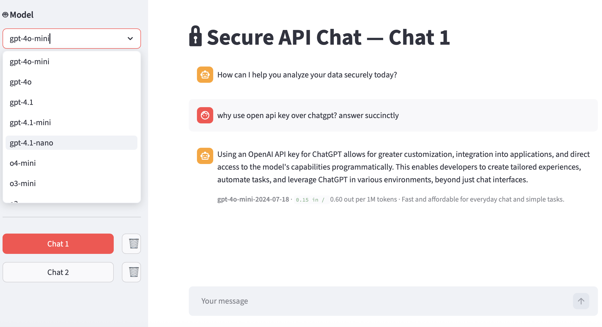

# Secure API Chat

A local Streamlit chat UI that talks to OpenAI via the API — not the ChatGPT website.

# Secure API Chat



## Why use this?

- Call OpenAI models directly with your own API key
- Choose the model from the sidebar (gpt-4o-mini, gpt-4o, gpt-4.1, o-series, etc.)
- Manage multiple chats, delete chats you no longer need
- See which model answered each message and its list price per 1M tokens

Using the [OpenAI API](https://platform.openai.com/docs) is different from using chatgpt.com. With an API key, requests follow OpenAI’s API data usage policies (see their docs for current terms). You are billed per token on your OpenAI account.

as of June 13th 2026:
## ⚡ Secure API Chat (API Key) vs. ChatGPT Web

| Pros | Cons |
| :--- | :--- |
| **Data Privacy:** API data is never used for model training. | **No Ecosystem Tools:** Loses Deep Research, Advanced Data Analysis, and Custom GPTs. |
| **Pay-As-You-Go:** Pay only for what you use; usually cheaper than $/month for light/moderate users. | **Setup Required:** Requires hosting or configuring a third-party front-end interface. |
| **No Caps:** Bypasses peak-hour slowdowns and strict 3-hour message limits. | **Accumulating Costs:** Very long chat threads resend history, increasing token costs. |
| **Hardcoded Personas:** System prompts remain strict and do not "drift" during long chats. | **No Native Sync:** Lacks automatic cross-device syncing without manual database setup. |

## available models

| Model | When to Use It |
| :--- | :--- |
| **gpt-5.4** | Use for your most complex coding, tool use, and advanced logical workflows. |
| **gpt-5.4-mini** | Use as your default for everyday tasks—fast, highly competent, and budget-friendly. |
| **gpt-5.4-nano** | Use for high-volume text classification, simple data parsing, or rapid extraction. |
| **o3** | Use when you need deep mathematical reasoning, competitive coding, or complex STEM problem-solving. |
| **o3-mini** | Use for fast, cost-efficient code generation and multi-step logic execution. |
| **gpt-4o-mini** | Use for highly optimized, ultra-cheap vision tasks and basic multimodal features. |
| **gpt-4.1** | Use for creative writing and prose automation where reasoning speed matters less than style. |
| **gpt-4.1-mini** | Use as an alternative, lightweight general-text processor for classic application integrations. |

## Quick start

```bash
cd secure-api-chat
python -m venv .venv
source .venv/bin/activate   # Windows: .venv\Scripts\activate
pip install -r requirements.txt